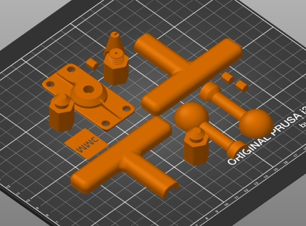

# Open-Wobble-Switch

## 3D Printing Instructions

### Print Settings
These print settings are for all files:
- Material: PLA
- Nozzle: 0.4 mm
- Infill: 20%
- Support: No
- Resolution: 0.2 mm
- Perimeters: 2

### Files
A single Open Wobble Switch will requires the follwing:
- 1X [OWS_Set.stl](OWS_Set.stl)

Individual files are stored in the [v1.0](/v1.0) folder if you want to print them separately (e.g. different colors, spare parts).

OWS_Set.stl consists of the following files:
 - 1X OWS_Mounting_Adapter.stl
 - 1X OWS_Nameplate.stl
 - 1X OWS_Topper_Gluing_Jig.stl
 - 1X OWS_Topper_Base.stl
 - 1X OWS_Topper_Ball_Set.stl
 - 1X OWS_Topper_Tee_Set.stl

OWS_Topper_Ball_Set.stl consists of the following files:
 - 1X OWS_Topper_Socket.stl
 - 1X OWS_Topper_Pin.stl
 - 1X OWS_Topper_Ball_Top.stl
 - 1X OWS_Topper_Ball_Bottom.stl

OWS_Topper_Tee_Set.stl consists of the following files:
 - 1X OWS_Topper_Socket.stl
 - 2X OWS_Topper_Pin.stl
 - 1X OWS_Topper_Tee_Top.stl
 - 1X OWS_Topper_Tee_Bottom.stl
