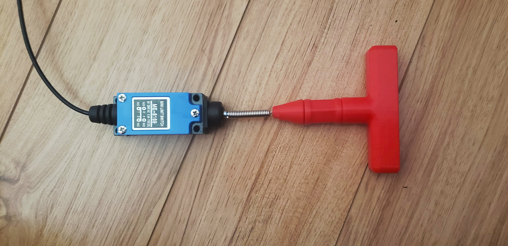

# Open-Wobble-Switch
The Open Wobble Switch is a cost effective, open source assistive switch similar to commercially available Wobble Switches. The switch is activated by applying force to and moving a wand in any direction. The switch can be activated by various body parts including the limbs and head. It provides a momentary closed contact that can be used to activate various assistive devices.

The switch requires approximately 0.55 N (55 gf) and about 24 mm of travel to operate, though this will vary a bit depending on the topper attached. The Open Wobble Switch has an interchangeable topper that can be swapped for different shapes and sizes

## More info at
- [Makers Making Change Project Page](https://www.makersmakingchange.com/project/open-wobble-switch/)
- [Makers Making Change Forum Thread](https://forum.makersmakingchange.com/t/open-source-wobble-switch/271)

## Getting Started

### 1. Order the Off-The-Shelf Components

The [Bill of Materials](/Documentation/Open_Wobble_Switch_BOM.xlsx) lists all of the parts and components required to build the Open Wobble Switch. The main switch component needs to be ordered online. The rest of the off-the-shelf components are also online or may be available in smaller quantities at your local hardware store or dollar store.

### 2. Print the 3D Printable components

Print the components for the switch and one or more toppers.

A single Open Wobble Switch will requires the following:

- 1X [OWS_Set.stl](/Build_Files/3D_Printing/OWS_Set.stl)

All of the files and individual print files can be in the [/Build_Files/3D_Printing_Files](/Build_Files/3D_Printing/) folder.

### 3. Assemble the Switch and Toppers

Reference the [assembly instructions]((/Documentation/Open_Wobble_Switch_Instructions_v1.0.pdf) for the tools and steps required to build each portion.

## Files
### Documentation
| Document             | Version | Link |
|----------------------|---------|------|
| Design Specification | WIP     |      |
| Design Rationale     | WIP     |      |
| Bill of Materials    | 1.0     | [Open_Wobble_Switch_BOM](/Documentation/Open_Wobble_Switch_BOM.xlsx)      |
| Assembly Guide       | 1.0     | [Open_Wobble_Switch_Instructions](/Documentation/Open_Wobble_Switch_Instructions_v1.0.pdf)     |
| Maker Checklist      | 1.0     | [Open_Wobble_Switch_Checklist](/Documentation/Open_Wobble_Switch_Checklist_v1.0.pdf)     |
| Quick Guide           | 1.0     |  [Open_Wobble_Switch_Quick_Guide](/Documentation/Open_Wobble_Switch_Quick_Guide_v1.0.pdf)    |
| Changelog              | 1.0    |  [Open_Wobble_Switch_Changelog](/Documentation/Open_Wobble_Switch_Changelog_v1.0.pdf)     |

### Design Files
[CAD Files](/Design_Files)

### Build Files
[3D Printing Files](/Build_Files/3D_Printing)

## License
 Open Wobble Switch by <a xmlns:cc="http://creativecommons.org/ns#" href="www.makersmakingchange.com" property="cc:attributionName" rel="cc:attributionURL">Neil Squire</a> is licensed under a <a rel="license" href="http://creativecommons.org/licenses/by-sa/4.0/">Creative Commons Attribution-ShareAlike 4.0 International License</a>.

## About Us

Makers Making Change is an initiative of [Neil Squire](https://www.neilsquire.ca/), a Canadian non-profit that helps people with disabilities.

We are committed to creating a network of volunteer makers who support people with disabilities in their communities through 3D printing assistive devices. Check out our library of free, open-source assistive technologies with parts and build instructions.

 - [www.MakersMakingChange.com](https://www.makersmakingchange.com/)
 - [GitHub](https://github.com/makersmakingchange)
 - [Thingiverse](https://www.thingiverse.com/makersmakingchange/about)
 - Twitter: [@makermakechange](https://twitter.com/makermakechange)
 - Instagram: [@makersmakingchange](https://www.instagram.com/makersmakingchange)

## Contact Us

For technical questions, to get involved, or share your experience we encourage you to visit the [MMC Project Page]( https://www.makersmakingchange.com/project), [MMC Forum](https://forum.makersmakingchange.com), or contact info@makersmakingchange.com
