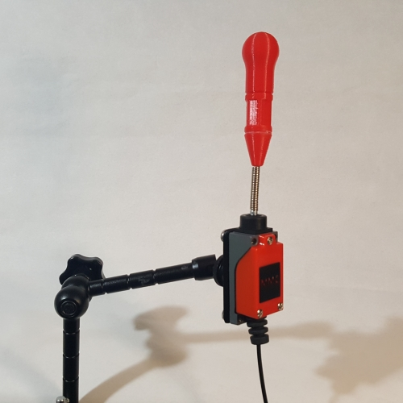

# Open-Wobble-Switch
The Open Wobble Switch is a cost effective, open source assistive switch similar to commercially available Wobble Switches. The switch is activated by applying force to and moving a wand in any direction. The switch can be activated by various body parts including the limbs and head. It provides a momentary closed contact that can be used to activate various assistive devices. The Open Wobble Switch has an interchangeable topper that can be swapped for different shapes and sizes. The switch requires approximately 0.55 N (55 gf) and about 24 mm of travel to operate, though this will vary a bit depending on the topper attached. 

Last Updated: 2024-Mar-21

## More info at
- [Makers Making Change Device Page](https://www.makersmakingchange.com/project/open-wobble-switch/)

## Getting Started

### 1. Order the Off-The-Shelf Components

The [Bill of Materials](/Documentation/Open_Wobble_Switch_BOM.xlsx) lists all of the parts and components required to build the Open Wobble Switch. The main switch component needs to be ordered online. The rest of the off-the-shelf components are also online or may be available in smaller quantities at your local hardware store or dollar store.

### 2. Print the 3D Printable components

Print the components for the switch and one or more toppers.

All of the files and individual print files can be in the [/Build_Files/3D_Printing_Files](/Build_Files/3D_Printing/) folder.

### 3. Assemble the Switch and Toppers

Reference the [assembly instructions](/Documentation/Open_Wobble_Switch_Instructions.pdf) for the tools and steps required to build each portion.

## Files
### Documentation
| Document             | Version | Link |
|----------------------|---------|------|
| Design Rationale     | 1.1     | [Open_Wobble_Switch_Design_Rationale](/Documentation/Open_Wobble_Switch_Design_Rationale.pdf)     |
| Bill of Materials    | 1.1     | [Open_Wobble_Switch_BOM](/Documentation/Open_Wobble_Switch_BOM.csv)     |
| Assembly Guide       | 1.1     | [Open_Wobble_Switch_Instructions](/Documentation/Open_Wobble_Switch_Instructions.pdf)     |
| Maker Checklist      | 1.1     | [Open_Wobble_Switch_Checklist](/Documentation/Open_Wobble_Switch_Checklist.pdf)     |
| Quick Guide          | 1.1     | [Open_Wobble_Switch_Quick_Guide](/Documentation/Open_Wobble_Switch_Quick_Guide.pdf)    |
| Changelog            | 1.1     | [Open_Wobble_Switch_Changelog](/Documentation/Open_Wobble_Switch_Changelog.pdf)     |

### Design Files
[CAD Files](/Design_Files)

### Build Files
 - [3D Printing Files](/Build_Files/3D_Printing)
 - [V1.1 3MF](/Build_Files/3D_Printing/OWS_All_v1.1.3mf)

## Attribution
Designers:
 - Birk Zukowsky
 - Gabriel Chu
 - Jake McIvor

## License
 Open Wobble Switch by <a xmlns:cc="http://creativecommons.org/ns#" href="www.makersmakingchange.com" property="cc:attributionName" rel="cc:attributionURL">Neil Squire</a> is licensed under a <a rel="license" href="http://creativecommons.org/licenses/by-sa/4.0/">Creative Commons Attribution-ShareAlike 4.0 International License</a>.

---

## About Makers Making Change

Makers Making Change is a program of [Neil Squire](https://www.neilsquire.ca/), a Canadian non-profit that uses technology, knowledge, and passion to empower people with disabilities.

Makers Making Change leverages the capacity of community based Makers, Disability Professionals and Volunteers to develop and deliver affordable Open Source Assistive Technologies.

 - Website: [www.MakersMakingChange.com](https://www.makersmakingchange.com/)
 - GitHub: [makersmakingchange](https://github.com/makersmakingchange)
 - X (formerly Twitter): [@makermakechange](https://twitter.com/makermakechange)
 - Instagram: [@makersmakingchange](https://www.instagram.com/makersmakingchange)
 - Facebook: [makersmakechange](https://www.facebook.com/makersmakechange)
 - LinkedIn: [Neil Squire Society](https://www.linkedin.com/company/neil-squire-society/)
 - Thingiverse: [makersmakingchange](https://www.thingiverse.com/makersmakingchange/about)
 - Printables: [MakersMakingChange](https://www.printables.com/@MakersMakingChange)

### Contact Us
For technical questions, to get involved, or to share your experience we encourage you to [visit our website](https://www.makersmakingchange.com/) or [contact us](https://www.makersmakingchange.com/s/contact).

